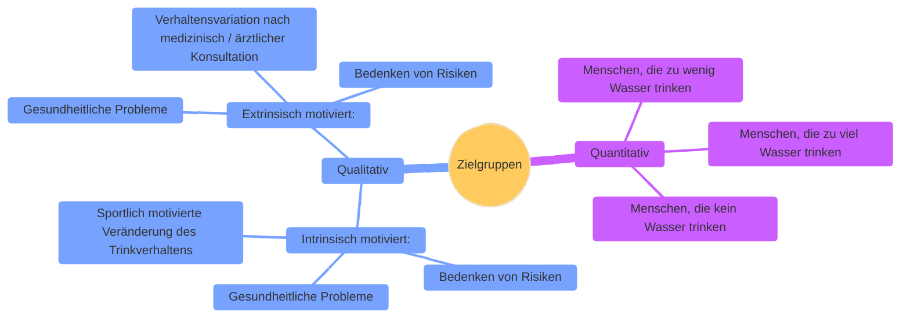

# Smarte Wasserflasche 
##  

## Zielgruppe(n)
 Nach der Identifikation der Zielgruppen erfolgt die Analyse derselben.
 Zunächst sollen nur der B2C[^1]-Ansatz verfolgt werden - eine Analyse 
 des potentiellen Marktes für B2B[^2] und weitere Segmente werden 
 fühestens in Q-III[^3] evaluiert.

### Definition

Grobe Unterteilung A (Quantitativ)
* Menschen, die zu wenig Wasser trinken
* Menschen, die zu viel Wasser trinken
* Menschen, die kein Wasser trinken

Grobe Unterteilung B (Qualitativ):
* <b>Intrinsisch motiviert</b>:
    * Gesundheitliche Probleme 
    * Bedenken von Risiken
    * Sportlich motivierte Veränderung des H2O-Trinkverhaltens

* <b>Extrinsisch motiviert</b>:
    * Gesundheitliche Probleme 
    * Verhaltensvariation nach medizinisch / ärztlicher Konsultation
    * Bedenken von Risiken
    
### Mindmap (Ausschnitt)

### Analyse
Erfolgt sobald das Produkt auf dem Markt platziert wurde und die Abverkäufe entprechend der Zielgruppendefinition zugeordnet werden konnten.

 

[^1]: Abk. f: Business-to-Consumer.
[^2]: Abk. f: Business-to-Business. 
[^3]: 3. Quartal 2025.