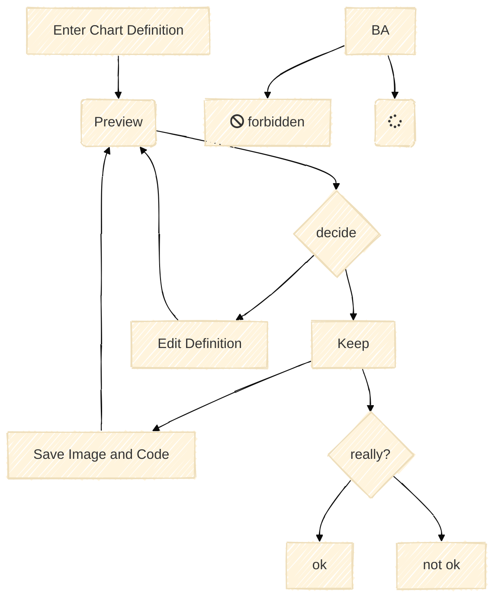

```mermaid
---
config:
  look: handDrawn
  theme: base
---
graph TD
    A[Enter Chart Definition] --> B(Preview)
    B --> C{decide}
    C --> D[Keep]
    C --> E[Edit Definition]
    E --> B
    D --> F[Save Image and Code]
    F --> B
    D --> G{really?}
    G --> H[ok]
    G --> I[not ok]
    BA --> CA[fa:fa-ban forbidden]
    BA --> DA(fa:fa-spinner);
```

