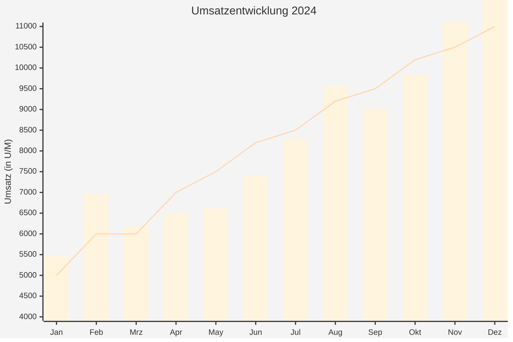

```mermaid
---
config:
  look: handDrawn
  theme: base
  xyChart:
        width: 900
        height: 600
           
            
            
            
---
xychart-beta
    title "Umsatzentwicklung 2024"
    x-axis [Jan, Feb, Mrz, Apr, May, Jun, Jul, Aug, Sep, Okt, Nov, Dez]
    y-axis "Umsatz (in U/M)" 4000 --> 11000
    bar [5473, 6960, 6183, 6496, 6613, 7405, 8285, 9562, 9008, 9830, 11122, 11947]
    line [5000, 6000, 6000, 7000, 7500, 8200, 8500, 9200, 9500, 10200, 10500, 11000]
```
Prognose: <b style="color:#ff3300">----</b> 